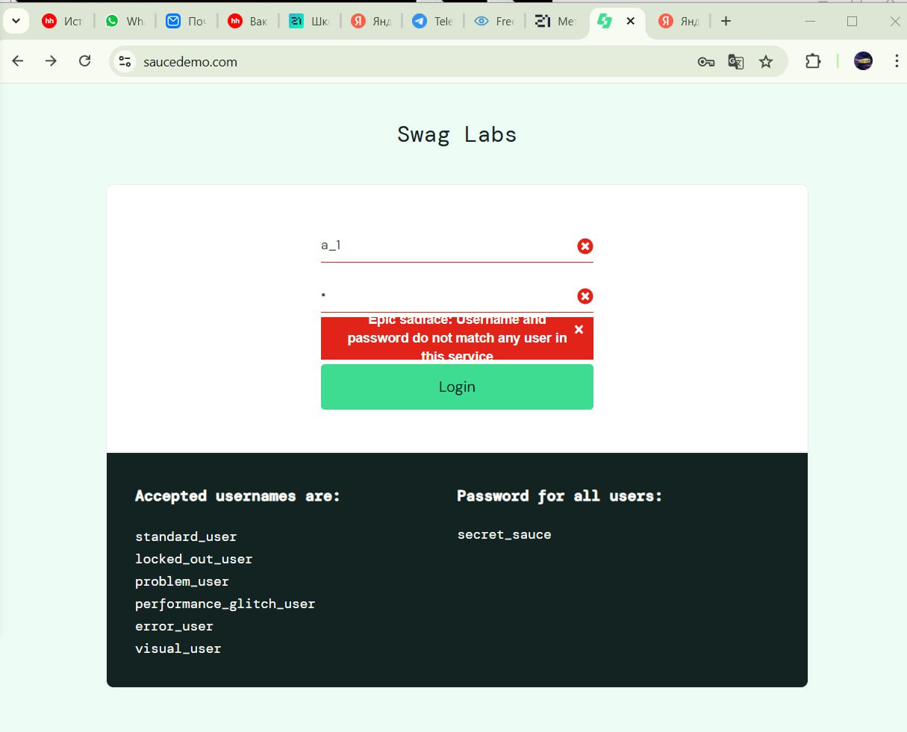

# Баг-репорт Saucedemo
**Название** Подсказака при некорректном вводе выходит за пределы фона \
**Приоритет** Low (Низкий)\
**Серьезность** Low (Низкий)
### Предусловия
1. Пользователь находится на странице авторизации: [https://www.saucedemo.com/](https://www.saucedemo.com/) 

### Шаги выполнения 

1. Открыть браузер на весь экран
2. В поле **Username** ввести `a_1`.  
3. В поле **Password** ввести `1`.  
4. Нажать кнопку **Login**.  

### Ожидаемый результат  
- Пользователь остается на странице авторизации.  
- Отображается подсказка `Epic sadface: Username and password do not match any user in this service` на красном фоне. распределена равномерно с некоторым отсутпом от края   

### Фактический результат
- Пользователь остается на странице авторизации. 
- Некорректно тображается подсказка `Epic sadface: Username and password do not match any user in this service` на красном фоне, первая и последние строка выходят за пределы фона 

**Примечания:**  
- Проверять в браузере Chrome версии 120+.    

**Дата выполнения:** 2024-05-30  
**Исполнитель:** @ninapete  

**Вложения**

